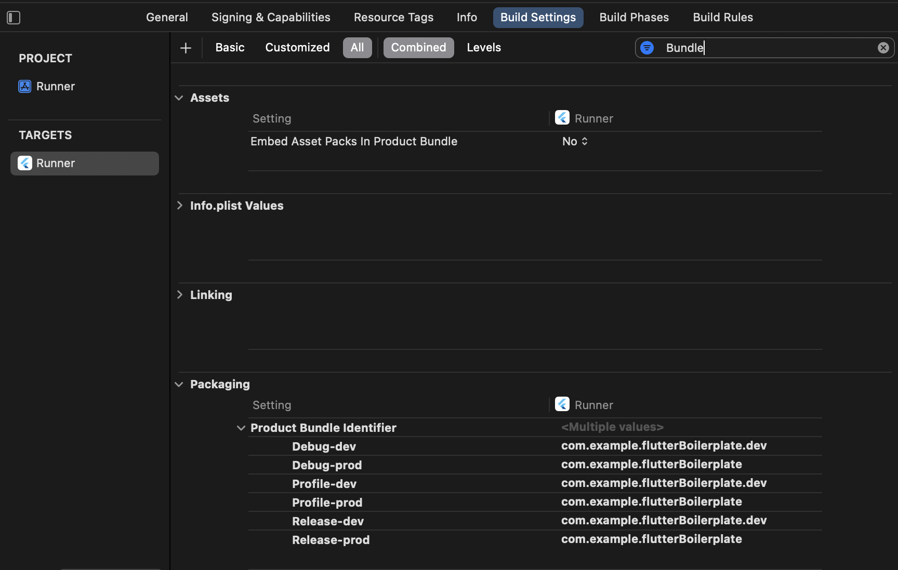
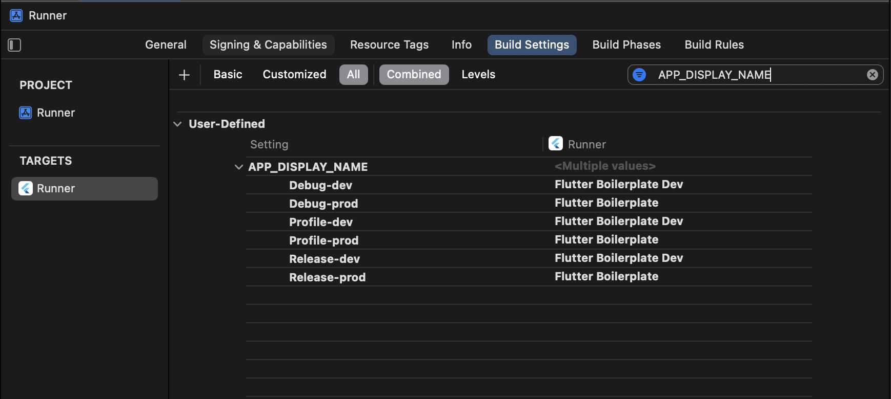
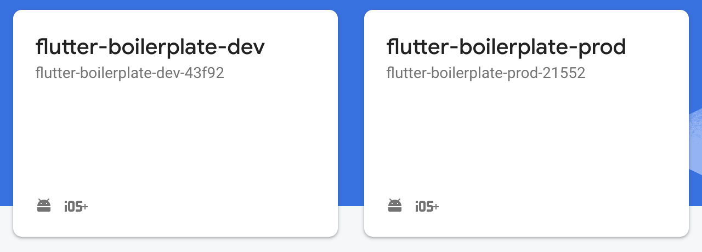
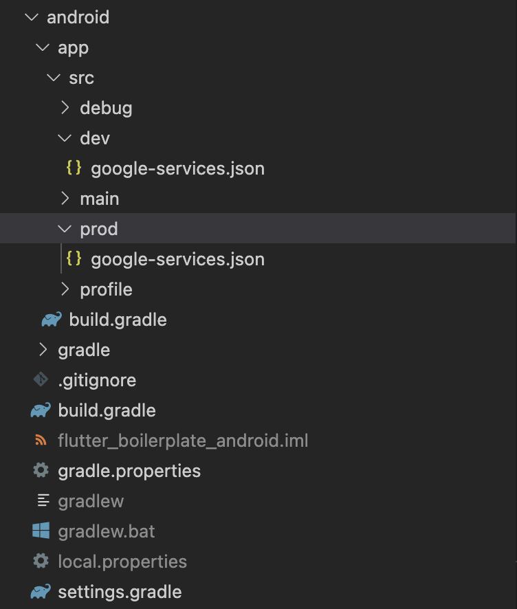
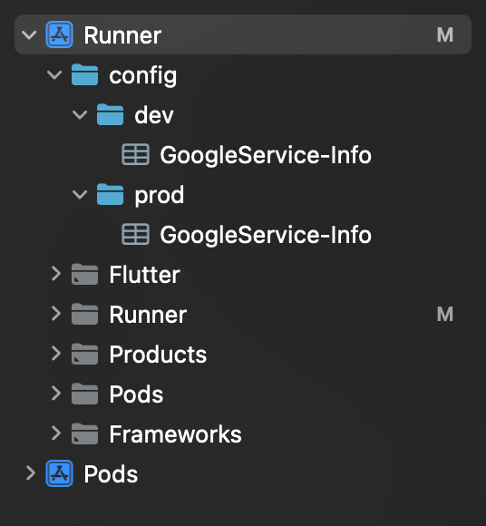
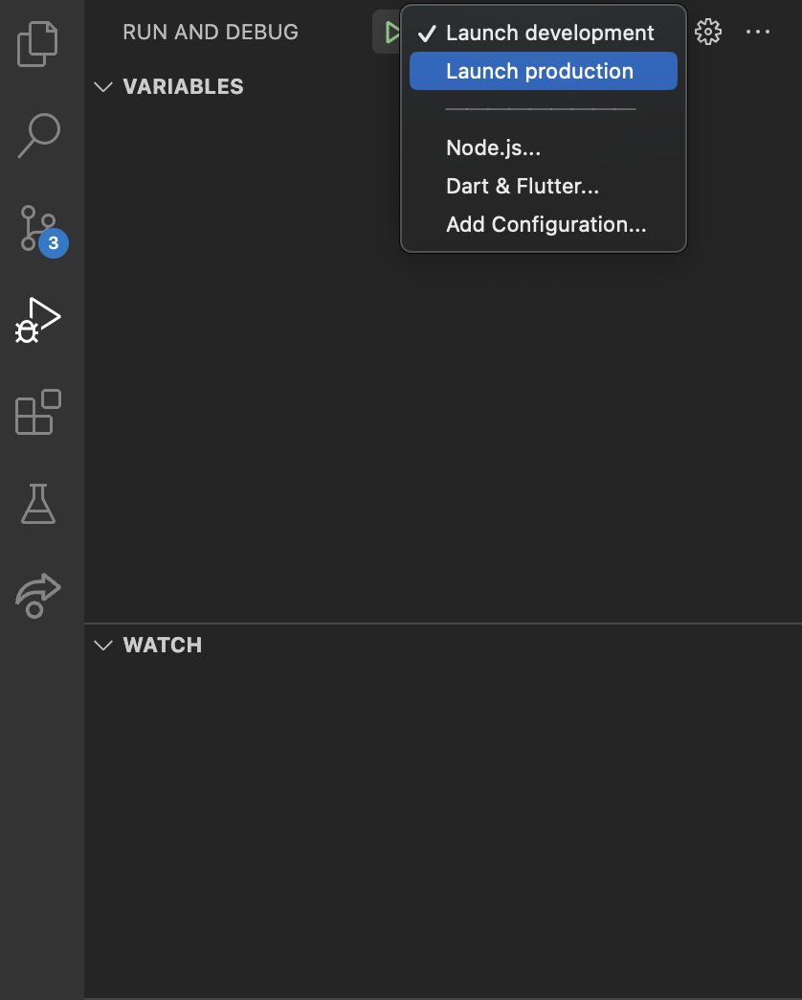

# Flutter Boilerplate

Flutter projeleri için bir şablon olarak kullanılabilir. Bu şablon, uygulama geliştirme sürecini hızlandırmak ve tekrar kullanılabilir bir kod temeli oluşturmak için tasarlanmıştır. Bu proje, Firebase gibi popüler araçları ve paketleri kullanarak geliştiricilerin uygulamalarını hızlı bir şekilde başlatmalarına yardımcı olur.

// üstteki yazıyı ingilizceye çevirip buraya yapıştırın

## Kurulum

Bu projeyi klonlayın ve geliştirme ortamınızı ayarlayın.

```bash
  git clone https://github.com/yunusemrealpak/flutter_boilerplate.git
  cd flutter-boilerplate
```

## Kullanım

- Bu projeyi klonladıktan sonra, `.env` dosyasındaki api url'leri değiştirmeyi unutmayın. Aksi takdirde, uygulamanız çalışmayacaktır.

```bash
  API_URL=<your-api-url>
  DEV_API_URL=<your-dev-api-url>
```

- Android için android/app/build.gradle altında flavor larınızı ayarlayın.

- Apple için uygulamanın bundle identifier ve display name ini aşağıdaki ekran görüntülerindeki gibi düzenleyin.





- Projenizin firebase ayarlarını yapma zamanı. Öncelikle firebase hesabınızdan dev ve prod için iki proje açın.



- Android için iki farklı bundle id ile iki firebase projesine entegre olun ve json dosyalarını görseldeki alanlara ekleyin.



- iOS için de aynı adımları izleyin ve görseldeki alanlara json dosyalarını ekleyin.



- Harika. Artık projenizi çalıştırmaya hazırsınız. VS Code da launch.json dosyası ayarlı bir şekilde gelecek. Ana dizinde .vscode altında istediğiniz gibi düzenleme yapabilirsiniz.



## Paketler

- auto_route
- dartz
- easy_localization
- dio
- flutter_bloc
- flutter_dotenv
- freezed
- get_it, injectable
- hive_flutter, shared_preferences
- firebase_dynamic_links

## Features

- Authentication
- Localization
- Dynamic Links
- Navigation
- State Management
- Dependency Injection
- Environment Variables
- Responsive UI
- Flavors (dev, prod)

### Flavor

Bu proje iki flavor'a sahiptir: dev ve prod. Flavor'ı `android/app/build.gradle` dosyasında değiştirebilirsiniz.

Her bir flavor için launch.json dosyası da yapılandırılmıştır. Aşağıdaki komutlarla uygulamanızı çalıştırabilirsiniz.

```json
  {
    "version": "0.2.0",
    "configurations": [
        {
            "name": "Launch development",
            "request": "launch",
            "type": "dart",
            "flutterMode": "debug",
            "program": "lib/main_dev.dart",
            "args": [
                "--flavor",
                "dev",
            ]
        },
        {
            "name": "Launch production",
            "request": "launch",
            "type": "dart",
            "flutterMode": "debug",
            "program": "lib/main_prod.dart",
            "args": [
                "--flavor",
                "prod",
            ]
        },
    ]
  }
```

```bash
  flutter run -t lib/main_dev.dart --flavor dev
  flutter run -t lib/main_prod.dart --flavor prod
```

veya

```bash
  sh scripts/build.sh -apk <flavor_name>
  sh scripts/build.sh -bundle <flavor_name>
```

## Destek

Bu projeyi beğendiyseniz, lütfen bir yıldız verin ⭐

## Yazarlar

- [@yunusemrealpak](https://github.com/yunusemrealpak)

## Lisans

[MIT](https://github.com/yunusemrealpak/flutter_boilerplate/blob/master/LICENSE)

